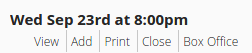
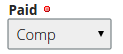

## Adding a Comp

Adding a complimentary ticket for a given show is a cinch.

* When you log into BuyPlayTix you should see a Dashboard for your current production.
* Find the show you want to add a reservation to.
* Then click *Add* from the list of links below the date.
  
* Fill in the contact information for the tickets and make sure to choose *Comp* from the
  *Paid* pull down.
  
* Click *Save*

Your complimentary ticket has been added.
