#The Box Office
The Box Office allows you to check in patrons as they arrive and sell 
additional tickets and concessions.

## Credit Card Scanners

### Phone/Tablet Scanner
The Box Office works with a mobile credit card scanner that hooks into the headphone
jack of supported tablets and phones. The Kindle Fire tablet is recommended as it's
inexpensive and works well. The mobile credit card scanner needs an app to work.

* [Kindle Fire App](https://www.amazon.com/Timothy-Thomas-BuyPlayTix-Ticketeer/dp/B06X1FYGVY/ref=pd_ybh_a_1?_encoding=UTF8&psc=1&refRID=CNZ9DW115E5W2PN17BHZ)
* [Android App](https://play.google.com/store/apps/details?id=com.buyplaytix.ticketeer)
* [iPhone/iPad App](https://itunes.apple.com/us/app/ticketeer/id632225011)

### USB Scanner
The USB scanner works with pretty much any computer and a web browser. Just plug it in.

## Getting Started

### Web

On the website click on Menu->Reservations. Choose the show date you want to take
tickets for and then click the Box Office icon.

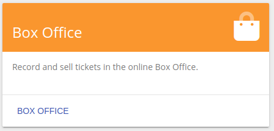

### Mobile
To get started on your mobile device click the Ticketeer app. 

You should be presented with a login screen. 

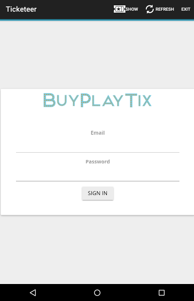

Enter your BuyPlayTix username and password. There is also a demo account you can use
for testing. Any credit cards scanned in the demo account will not be charged and
the data will be reset every 15 minutes.

To use the demo account login with:

Username: demo

Password: demo

You'll next be prompted to choose your production and show date. Normally this 
 will automatically select the next show.
 
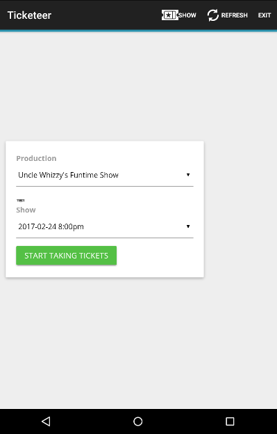

Click "Start Taking Tickets" and you're ready to go.
 
## The Register Tab

The Register is the first tab and contains buttons with each item that
you have setup to sell. There will be one button for each ticket price. Buttons
for concessions. A button for donations, and finally a custom button that can
catch any oddities that may come up in a Box Office. And for some reason they
always do.
 
### Selling Tickets

Selling tickets works the same way whether on mobile or the web.
 
First click the ticket price you want to sell.
 
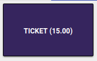

Next enter your quantity. It works like a calculator. Press or click the numbers to 
 get the quantity you want to sell.
 
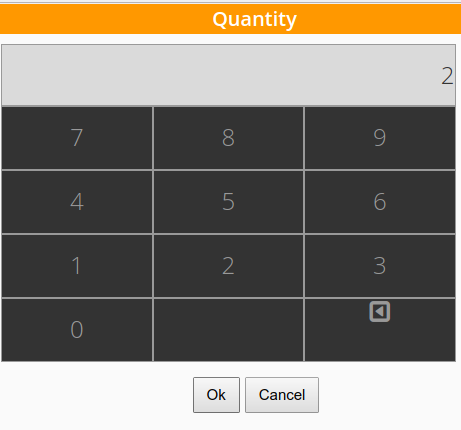

Then enter the payment type. If you want to sell more than one item in a single transaction
you can click 'Add to Cart'. Cash and Checks will both go through immediately. Credit
will prompt you for a credit card transaction. Pass will prompt you for a season
passcode.
 
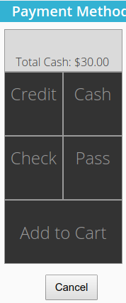
 
#### Using the Mobile Scanner

On the mobile app when you click the 'Credit' button you should see a prompt to 
scan the card.

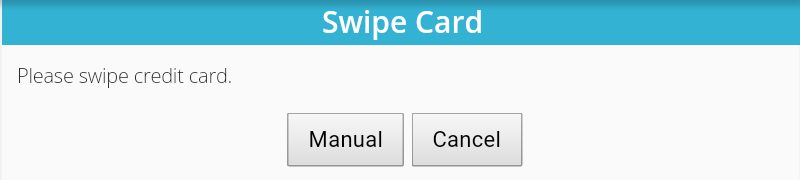

Swipe the card. You'll need to do it quickly and it can take a bit of practice
to get used to it. I recommend testing it out with the demo account I mentioned in the 
**Mobile** section above.

If it works you'll be prompted to enter an email address. That part is optional.

If it succeeds you'll be returned to the register.

When the mobile scanner doesn't work you can enter the credit card information manually
by clicking the "Manual" button. It's not fun, but it works.

#### Using the USB Scanner
When you click the 'Credit' button on the website you'll see the manual credit card
entry page. 

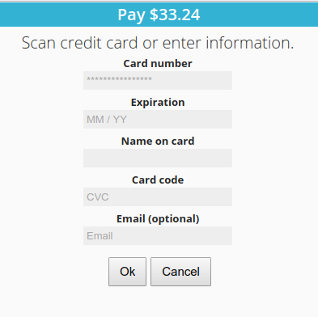

*Fear not!* You don't have to enter all that info. Just scan the card with the USB
scanner and it will automatically fill in the fields and click the Ok button for you.

And if the usb scanner doesn't work you can still enter the credit card information by hand.
 **grumble**, **grumble**

### Concessions

#### Adding Concessions

Concessions can be added by going to Menu->Concessions->Add Concession. From the mobile
app you can click the menu button.

Then click 'Add Concessions'

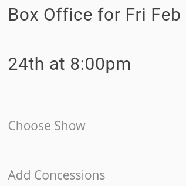

Each concession will get their own button on the Box Office Screen. In this example
we've added Water and Popcorn Concessions.

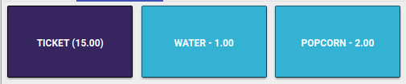

#### Selling Concessions
Concessions are sold exactly the same way as tickets. Click on the Concession, then 
 enter the quantity. You can add the concessions to a shopping cart or process them
 right away.

### Donations
Donations work much the same way as tickets. Frequently if you want to sell an $18
ticket and the customer only has a $20 bill you can add one $18 ticket to the cart
and then add a $2 donation.

**Be Careful**: The donation button takes you to an amount screen, not a quantity screen.

Enter the amount of the donation in dollars. Donations also have an optional space for
a patron name (in case you want to send them a thank-you later).

### Custom Priced Tickets

There is also a custom price button. This gives you the ability to accept all the
oddities that come up with running a box office without changing your entire ticketing
structure.

**Be Careful**: The custom price button asks you for both a quantity and a price. 

So for example: at the first prompt you would enter 2 for the quantity and then
 at the second prompt enter $5. Which would add 2 $5 tickets to your shopping cart.
 
Custom Prices also require that you enter a Name/Comment. This will help you remember *why*
you granted that custom price when it comes time to reconcile
your reports.

## The Sales Tab
The sales tab has a list of all sales for the evening. If you make an erroneous cash 
or check sale you can delete it by clicking the delete button. 

 
If you have sold an item using a credit card you'll have to process a refund. Credit
card transactions have a gear next ot them. Click on the gear.

And click the red Refund button on the page you're taken to.
 

## The Reservations Tab

### Picking up Tickets

Picking up tickets is just a way of keeping track of which of your prepaid patrons
have arrived.

#### Scanning Tickets (Mobile Only)

Scanning tickets only works on the mobile app with users who have printed the tickets
or have them on their cell phone. Have the customer bring up the ticket. Then click
the Scan button in the app.

Your camera app should open up. Focus on the 2d barcode on the customers ticket and
it should automatically pickup the tickets and return you to the Register.

### Manual Pickup

If you're like me, scanning each individual ticket is time consuming and doesn't move
 fast enough. You can also manually enter people as the arrive on the Reservations tab.
Simply choose the number of tickets picked up. You don't have to pickup all
the tickets at once, as you'll inevitably have the parties that have arrived in more
than one car or pedicab.
  
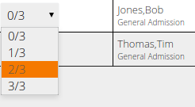
  
Once all the tickets have been picked up, the free ticket button will go away and the
line will be crossed out.
   
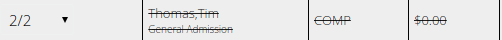

### Freeing Tickets

So what happens if you need to free up all reservations 10 minutes before showtime, or
Bob decided he didn't want to see this show and so the party that arrived via pedicab
has an extra ticket? No sweat, you can free those tickets so they can be resold.

Click on the free icon (butterflies like to be free).

You'll be prompted to be sure you want to do that. 

## What if something goes wrong?
First try clicking the refresh button.

If you're having trouble with the credit card swiper, try removing it and re-inserting it.

Finally if things don't get better try killing the app, restarting your device, or
sending an email to <a href="mailto:support@buyplaytix.com">support@buyplaytix.com</a>

