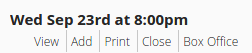

## Printing Reservations

* When you log into BuyPlayTix you should see a Dashboard for your current production.
* Find the show you want to print the reservations for.
* Then click *Print* from the list of links below the date.
  
* A new window or tab should open with a printer-friendly list.

This report can be customized by choosing *Settings* from the main menu, and then clicking on *Edit Print Report*.
